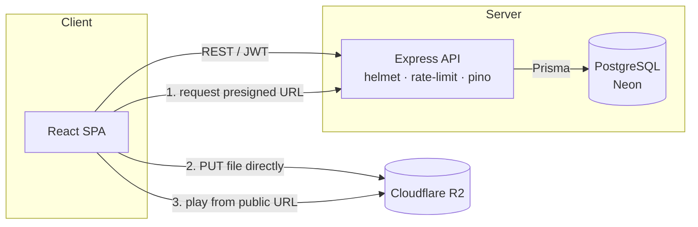

# YouTube Clone — Full-Stack Video Platform

A production-style video-sharing platform (YouTube clone) built to demonstrate
real backend engineering: layered API design, relational data modeling, direct-to-storage
file uploads, JWT auth, and a documented, tested REST API.

<!-- Fill these in after deploying (Tier 1, step 4) -->
**🔗 Live demo:** _coming soon_ &nbsp;·&nbsp; **📖 API docs (Swagger):** _coming soon_ (`/api/docs`)

> **Demo login** — username: `demo_alice` &nbsp; password: `demo1234`


---

## Features

- **Auth** — signup/signin with bcrypt-hashed passwords and JWT bearer tokens
- **Video uploads** — files go **directly from the browser to Cloudflare R2** via presigned URLs (secrets never touch the client)
- **Engagement** — comments, like/dislike reactions, channel subscriptions, view counts, watch history
- **Discovery** — title search (Postgres `ILIKE`) and cursor-based pagination
- **Channel pages** — per-channel profile, subscriber count, and video grid
- **Authorization** — owner-only deletes (comments), returns proper `403`s
- **Interactive API docs** — Swagger UI at `/api/docs`
- **Production hardening** — Helmet security headers, rate limiting, structured logging (pino), `/health` check, fail-fast env validation (zod)

## Tech stack

| Layer | Choice | Why |
|-------|--------|-----|
| Runtime | **Bun** | Fast install + native TS, single toolchain for API and web |
| API | **Express 5 + TypeScript** | Familiar, explicit middleware pattern |
| ORM / DB | **Prisma 7 + PostgreSQL** (Neon) | Type-safe queries, migrations, relational modeling |
| Storage | **Cloudflare R2** (S3-compatible) | Cheap object storage; presigned direct uploads |
| Validation | **Zod v4** | One schema validates both env vars and request bodies |
| Auth | **JWT + bcrypt** | Stateless auth, hashed credentials |
| Frontend | **React 19 + react-router** | SPA with the video/watch/channel screens |
| Docs | **OpenAPI 3 + swagger-ui-express** | Self-serve, interactive API reference |
| Tests | **bun:test + supertest** | In-memory integration tests against the real app |

## Architecture



**Upload flow (why it's interesting):** the browser asks the API for a short-lived
presigned `PUT` URL, uploads the file straight to R2, then sends only the resulting
public URL back to the API to save. Large files never proxy through the API, and R2
credentials stay server-side.

## Project structure

```
backend/
  src/
    config/env.ts        # zod-validated environment (fails fast at startup)
    lib/db.ts            # Prisma client
    lib/r2.ts            # S3/R2 client + presign helper
    middleware/auth.ts   # requireAuth / optionalAuth -> req.userId
    middleware/error.ts  # asyncHandler + central error handler
    routes/              # auth, videos, comments, likes, subscriptions, channels
    docs/openapi.ts      # OpenAPI 3 spec (served at /api/docs)
    app.ts               # express wiring (build the app)
  prisma/
    schema.prisma        # User, Uploads, Comment, Like, Subscription, WatchHistory
    seed.ts              # demo data  ->  bun run seed
  tests/api.test.ts      # integration tests
  index.ts               # bootstrap: app.listen
frontend/
  src/
    config.ts            # API base URL (BUN_PUBLIC_API_URL)
    components/          # Appbar, VideoCard
    screens/             # Landing, VideoPage, Channel, Signin, Signup, Upload
```

## Local setup

**Prerequisites:** [Bun](https://bun.com), a PostgreSQL database (e.g. a free [Neon](https://neon.tech) project), and a [Cloudflare R2](https://developers.cloudflare.com/r2/) bucket.

### 1. Backend

```bash
cd backend
bun install
cp .env.example .env          # then fill in the values
bun --bun prisma migrate deploy   # apply the schema
bun run seed                  # optional: load demo data
bun run dev                   # http://localhost:3000
```

Open **http://localhost:3000/api/docs** for the interactive API.

### 2. Frontend

```bash
cd frontend
bun install
bun run dev                   # http://localhost:3001
```

For a non-local API, set `BUN_PUBLIC_API_URL` (see `frontend/.env.example`).

## Environment variables (backend)

| Var | Description |
|-----|-------------|
| `DATABASE_URL` | Postgres connection string |
| `JWT_SECRET` | Long random string used to sign JWTs |
| `R2_accessKey` / `R2_secretKey` | R2 S3-API token (Object Read & Write) |
| `R2_bucket` | Bucket name |
| `R2_publicUrl` | Public base URL of the bucket (`https://pub-xxxx.r2.dev`) |

## Testing

```bash
cd backend
bun test          # integration tests: auth flow, CRUD, authorization (403)
bun run typecheck # tsc --noEmit
```

## Future work

- Async **video transcoding pipeline** (BullMQ + Redis worker + ffmpeg → HLS adaptive streaming)
- Redis caching on the hot read path
- Refresh tokens in httpOnly cookies
- Full-text search via Postgres `tsvector`
- Docker Compose + CI (GitHub Actions)
